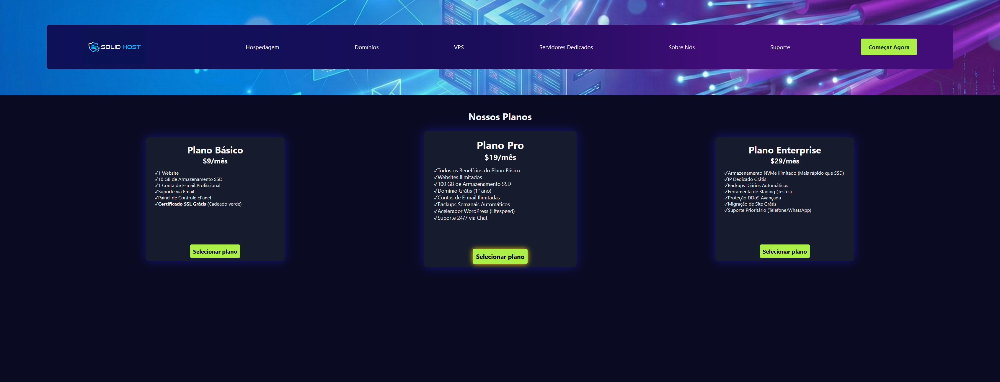

# 🚀 Tabela de Preços - Solid Host


## Sobre o Projeto

Este projeto consiste no desenvolvimento de uma interface de **Tabela de Preços (Pricing Table)** para uma empresa fictícia de hospedagem de sites chamada "Solid Host".

O foco principal foi criar um layout visualmente agradável com tema escuro (Dark Mode) e praticar o posicionamento de elementos usando CSS puro.

🔗 **[Acesse o projeto online aqui](Adicionar link do github pages)**

---

## 🛠️ Tecnologias Utilizadas

* **HTML5** (Semântico)
* **CSS3**
    * Flexbox (para layouts e alinhamentos)
    * Pseudo-elementos (`::before` para ícones)
    * CSS Transitions e Transforms

---

## ✨ Funcionalidades e Destaques

* **Layout de Cards:** Três opções de planos (Básico, Pro, Enterprise) alinhados via Flexbox.
* **Destaque Visual:** O plano "Pro" possui uma escala maior (`transform: scale(1.1)`) e sombra dourada para atrair a atenção do usuário.
* **Interatividade:**
    * Efeitos de `hover` nos links da navegação e botões.
    * Animação suave de transição (`0.2s ease`).
* **Estilização Customizada:** Uso de `linear-gradient` na barra de navegação e substituição dos marcadores de lista padrão por um "checkmark" (✓) usando CSS.

---

## 📂 Estrutura do Código

O projeto foi estruturado pensando na separação de responsabilidades:
* `index.html`: Estrutura do conteúdo e textos.
* `styles.css`: Estilização visual, reset CSS básico e regras de responsividade.

---

## 🚀 Como rodar o projeto

1.  Clone este repositório:
    ```bash
    git clone [https://github.com/SEU-USUARIO/NOME-DO-REPO.git](https://github.com/SEU-USUARIO/NOME-DO-REPO.git)
    ```
2.  Abra o arquivo `index.html` no seu navegador de preferência.

---

Desenvolvido por **[Fabio Capello de Souza]** como parte do meu portfólio de Front-End.
